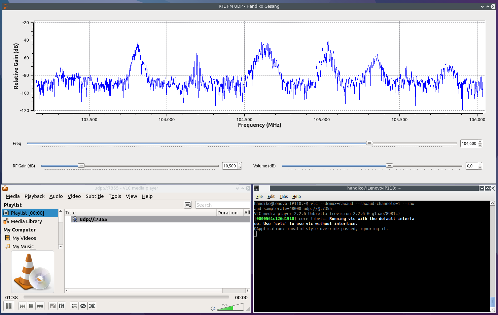

# How to Stream the Audio Out from GNU Radio into VLC Media Player
*(Tested on GNU Radio 3.7.10 and Ubuntu 16.04)*


The background behind this is that when you are using RTL SDR and onboard soundcard simultaneously as the I/O in GNU Radio, sometimes their hardware clock is not synchronized one on another, therefore after some amount of time, their clock drift is become significant enough to cause the famous problem which is **audio-underrun** or **audio-overrun**. This symptoms causes very annonying **audio break** (choppy audio) and indicated in the GNU Radio output console:

```
Using device #0 Realtek RTL2838UHIDIR SN: 00000002
Found Rafael Micro R820T tuner
[R82XX] PLL not locked!
[R82XX] PLL not locked!
gr::log :INFO: audio source - Audio sink arch: alsa
aUaUaUaUaUaUaUaUaUaUaUaUaUaUaUaUaUaUaUaUaUaUaUaUaUaUaUaUaUaUaUaUaUaUaUaUaUaUaUaUaUaUaUaUaUaUaUaU
```
I tried to solve this problem by streaming the audio into VLC media player through an UDP sink block. In my circumstances, the problem goes away and the VLC itself provides another very neat feature: Audio Equalizer

## Requirements
* GNU Radio [GitHub repo](https://github.com/gnuradio/gnuradio)
* RTL SDR dongle
* gr-osmosdr [GitHub repo](https://github.com/osmocom/gr-osmosdr)
* rtl-sdr [GitHub repo](https://github.com/osmocom/rtl-sdr)
* VLC media player

## Downloading
Open the terminal and type:
```
git clone https://github.com/handiko/RTL-FM-VLC.git
```
This repo then will be downloaded into your **/home/RTL-FM-VLC** folder. 

## The Flowgraph
The flowgraph is included in **RTL-FM-VLC/gnuradio-flowgraph** folder. There is not much to the flowgraph itself, nothing fancy. The special bits is that now you have three additional blocks which you have to add to your "ordinary fm receiver" flowgraph, which are float-to-short, endian-swap, and UDP sink.

Start off by disabling float-to-short, endian-swap, and UDP sink block and enabling the Audio Sink block. This test is done to ensure that you can receive the FM station you are trying to receive, properly.


After you are sure that the FM receiver works properly, now disable the Audio Sink block and enable the float-to-short, endian-swap, and UDP sink.


Run the GNU Radio flowgraph, open the terminal, and type:
```
vlc --demux=rawaud --rawaud-channels=1 --rawaud-samplerate=48000 udp://@:7355
```

Now the flowgraph should stream the audio into the VLC media player. You can confirm this by controlling the audio volume from the VLC.


## Audio Reception Sample
I added an audio wav file (titled: fm.wav) which included in **RTL-FM-VLC/sample folder**. Just double click it and you have the idea about the reception quality that I've got.

## Tips
* If the audio sounds a little bit rough, try to increase of decrease the volume through the GNU Radio application.
* You can add another UDP instance by adding another UPD Sink and allocate another port number.
* Use the VLC built-in equalizer to shape the audio quality to your favor.

## Acknwoledgement
* [Alexandru Csete OZ9AEC](http://gqrx.dk/doc/streaming-audio-over-udp)

## Contributing
1. Fork it [https://github.com/handiko/RTL-FM-VLC/fork](https://github.com/handiko/RTL-FM-VLC/fork)
2. Create new branch (`git checkout -b myfeature`)
3. Do some editing / create new feature
4. Commit your works (`git commit -m "Adding some myfeature blah blah blah.."`)
5. Push to the branch (`git push -u origin myfeature`)
6. Create a new Pull Request
